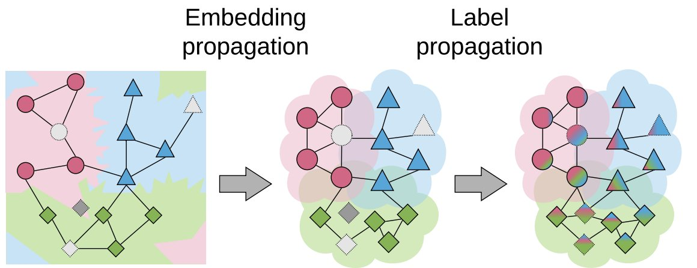

[](https://opensource.org/licenses/Apache-2.0)


<h1 align="center">Embedding Propagation </h1>
<h5 align="center">Smoother Manifold for Few-Shot Classification <a href="https://arxiv.org/abs/2003.04151">[Paper]</a> </h5> 


Embedding propagation can be used to regularize the intermediate features so that generalization performance is improved.



## Usage

Add an embedding propagation layer to your network.

```
pip install git+https://github.com/ElementAI/embedding-propagation
```

```python
import torch
from embedding_propagation import EmbeddingPropagation

ep = EmbeddingPropagation()
features = torch.randn(32, 32)
embeddings = ep(features)
```

## Experiments 

Generate the results from the <a href="https://arxiv.org/abs/2003.04151">[Paper]</a>.

### Install requirements

`pip install -r requirements.txt`
 
This command installs the [Haven library](https://github.com/ElementAI/haven) which helps in managing the experiments.

### Download the Datasets

* [mini-imagenet](https://github.com/renmengye/few-shot-ssl-public#miniimagenet) ([pre-processing](https://github.com/ElementAI/TADAM/tree/master/datasets))
* [tiered-imagenet](https://github.com/renmengye/few-shot-ssl-public#tieredimagenet)
* [CUB](https://github.com/wyharveychen/CloserLookFewShot/tree/master/filelists/CUB)

<!-- You can either edit `data_root` in the `exp_configs/[pretraining|finetuning].py` or create a symbolic link to the each of the dataset folders at `./data/dataset-name/` (default). -->

### Reproduce the results in the paper

#### 1. Pre-training

```
python3 trainval.py -e pretrain -sb ./logs/pretraining -d <datadir>
```
where `<datadir>` is the directory where the data is saved.

#### 2. Fine-tuning

In `exp_configs/finetune_exps.py`, set `"pretrained_weights_root": ./logs/pretraining/`

```
python3 trainval.py -e finetune -sb ./logs/finetuning -d <datadir>
```

### 3. SSL experirments with 100 unlabeled

In `exp_configs/ssl_exps.py`, set `"pretrained_weights_root": ./logs/finetuning/`

```
python3 trainval.py -e ssl_large -sb ./logs/ssl/ -d <datadir>
```

### 4. SSL experirments with 20-100% unlabeled

In `exp_configs/ssl_exps.py`, set `"pretrained_weights_root": ./logs/finetuning/`

```
python3 trainval.py -e ssl_small -sb ./logs/ssl/ -d <datadir>
```

### View the Results
|support_size|dataset_train|backbone|test_accuracy|test_confidence|
|:----------------:|:-----------:|:------:|:-----------:|:-------------:|
|        1         |     cub     | conv4  |   0.6692    |    0.0094     |
|        1         |     cub     |resnet12|   0.8285    |    0.0081     |
|        1         |     cub     |  wrn   |   0.8775    |    0.0070     |
|        1         |miniimagenet | conv4  |   0.5932    |    0.0084     |
|        1         |miniimagenet |resnet12|   0.6837    |    0.0086     |
|        1         |miniimagenet |  wrn   |   0.7074    |    0.0086     |
|        1         |tiered-imagen| conv4  |   0.6070    |    0.0097     |
|        1         |tiered-imagen|resnet12|   0.7677    |    0.0085     |
|        1         |tiered-imagen|  wrn   |   0.7850    |    0.0086     |
|                  |             |        |             |               |
|        5         |     cub     | conv4  |   0.7984    |    0.0067     |
|        5         |     cub     |resnet12|   0.9132    |    0.0042     |
|        5         |     cub     |  wrn   |   0.9404    |    0.0036     |
|        5         |miniimagenet | conv4  |   0.7295    |    0.0063     |
|        5         |miniimagenet |resnet12|   0.8152    |    0.0058     |
|        5         |miniimagenet |  wrn   |   0.8434    |    0.0056     |
|        5         |tiered-imagen| conv4  |   0.7391    |    0.0074     |
|        5         |tiered-imagen|resnet12|   0.8748    |    0.0058     |
|        5         |tiered-imagen|  wrn   |   0.8845    |    0.0053     |

## Citation
```
@article{rodriguez2020embedding,
  title={Embedding Propagation: Smoother Manifold for Few-Shot Classification},
  author={Pau Rodríguez and Issam Laradji and Alexandre Drouin and Alexandre Lacoste},
  year={2020},
  journal={arXiv preprint arXiv:2003.04151},
}
```
